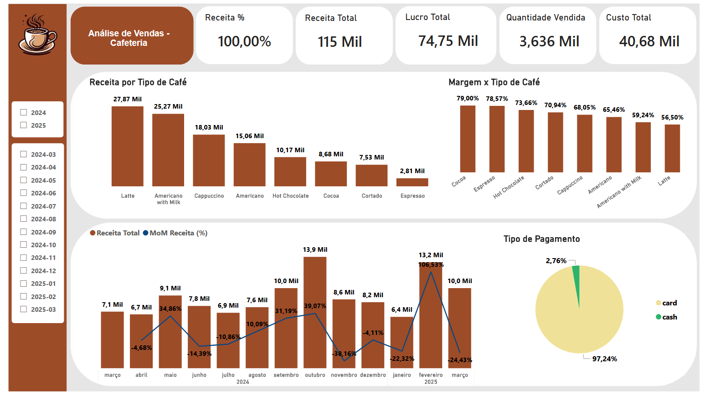

# Dashboard Análise de Vendas (Cafeteria) – Power BI

## 📊 Objetivo
Analisar o desempenho das vendas da cafeteria, comparando os tipos de cafés vendidos e as formas de pagamento, com foco na evolução mensal da receita.

## 🧰 Ferramentas
- Power BI
- DAX
- Excel / CSV (dataset público)

## 📈 Principais Métricas
- Receita Total e Receita por Tipo de Café
- Lucro Total
- Quantidade Vendida
- Tipo de Pagamento
- Receita Total x MoM
- Margem de Lucro % x Tipo de Café

## 🖼️ Dashboard

## 📂 Arquivos
- [📊 Download do Dashboard (.pbix)](Analise_Cafeteria_Portfolio.pbix)
- [📄 Dashboard em PDF](Analise_Cafeteria_Portfolio.pdf)

